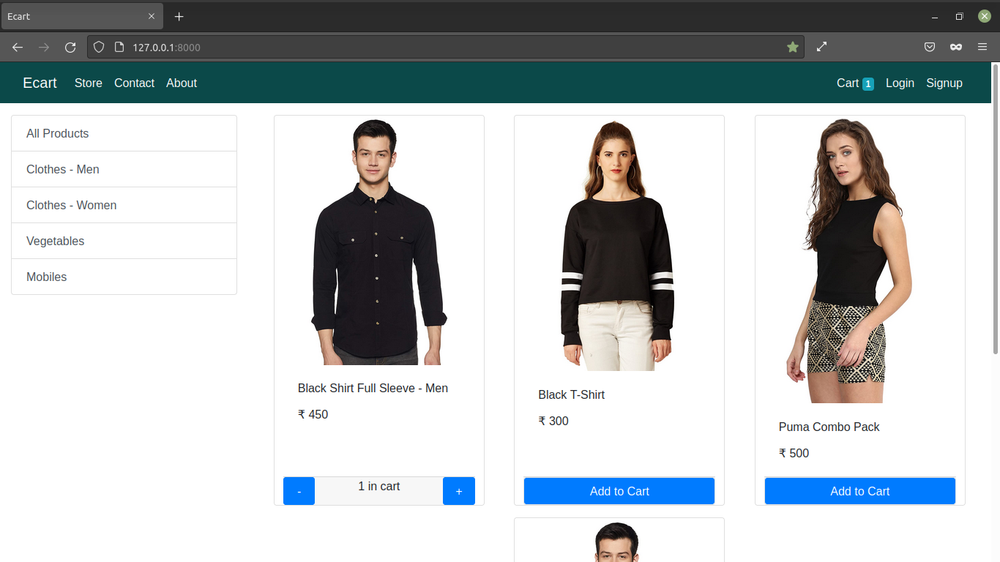

# Basic Ecommerce Project Using Django Framework

### Hello there to download and run the project without any errors follow the steps given below the tutorial of this project credit goes to "Feel Free to Code" - Youtube Channel
---
### Note:
#### To run this djago project without any errors you need to create and activate virtual environment and Install django in it.
#
### Admin
- Username ```admin```
- Password ```admin```  

---


---
## Windows


- Clone this repository using  => git clone [repository link] or download and extract zip file
```
git clone https://github.com/jenish-codes/Ecommerce-Basic-Project-Using-Django.git
```

- Navigate to this repository using command line
```
cd Ecommerce-Basic-Project-Using-Django
```

- Crete virtual environment => py -m venv [virtual environment name]
```
py -m venv env
```
 - Activate virtual environment
 ```
 env\Scripts\activate.bat
 ```

 - Install requirements => 
 ```
 pip install -r requirements.txt
 ```
 - Run Server
 ```
  py manage.py runserver
 ```

 ## Linux / Mac


- Clone this repository using  => git clone [repository link] or download and extract zip file
```
git clone https://github.com/jenish-codes/Ecommerce-Basic-Project-Using-Django.git
```

- Navigate to this repository using command line
```
cd Ecommerce-Basic-Project-Using-Django
```

- Crete virtual environment => python3 -m venv [virtual environment name]
```
python3 -m venv env
``` 
 - Activate virtual environment => 
 ```
  source myproject/bin/activate
  ```

 - Install requirements => 
 ```
 pip install -r requirements.txt
 ```
- Run Server
 ```
  python3 manage.py runserver
 ```


 ##### Note: If any errors occured Google that issue. 